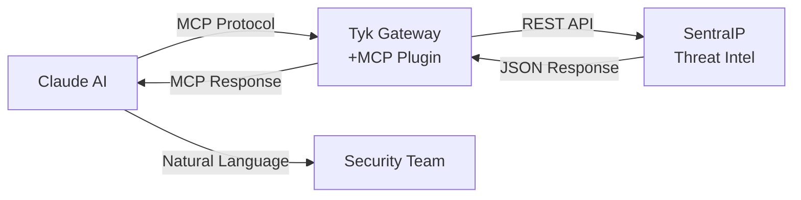

# Tyk MCP Integration: Experimental Use Case

## What This Experiment Demonstrates

This experimental project shows how to **transform Tyk Gateway into an MCP (Model Context Protocol) server**, demonstrating the Four Pillars of AI-Ready APIs by making SentraIP threat intelligence accessible to AI models like Claude through natural language conversations.

## The Concept Being Tested

### Current State
- **Claude AI**: "I can only use information from my training data"
- **SentraIP API**: "I have live threat intelligence but only speak REST"
- **Tyk Gateway**: "I manage APIs but AIs can't use me directly"

### Experimental Integration  
- **Claude AI**: "Who is attacking us right now?"
- **This Prototype**: Claude → MCP → Tyk → SentraIP → Real threat data → Natural language response

## How It Works



### The Magic: Tyk Becomes an MCP Server

1. **Custom Go Plugin** added to Tyk Gateway
2. **Two new endpoints** exposed:
   - `/mcp/tools` - "What can I do?"
   - `/mcp/execute` - "Do this task"
3. **Protocol Translation** - Converts between MCP and REST automatically

### Real-World Usage

**Instead of this traditional approach:**
```bash
curl -X GET "https://api.sentraip.com/v1/ip/185.220.101.45/reputation"
# Returns complex JSON that humans need to interpret
```

**You can now do this:**
```
Human: "Check if IP 185.220.101.45 is dangerous"
Claude: "That IP is a known botnet controller from Russia with a 
        threat score of 95/100. I recommend blocking it immediately."
```

## Prototype Benefits

- **Conversational Security**: Natural language security queries (experimental)
- **Real-time Intelligence**: Live threat data through AI (proof of concept)
- **Enterprise Foundation**: Built on Tyk's API management (demonstration)
- **Universal Pattern**: Shows how any REST API could become an AI tool (use case)

## Architecture Components

- **Tyk Gateway**: API management + custom MCP plugin
- **SentraIP**: Threat intelligence data source  
- **Claude**: AI model with MCP client capabilities
- **OpenTelemetry**: Complete observability and tracing
- **Kubernetes**: Production deployment on GKE

## The Innovation

**This proves the concept that any API gateway can become an MCP server**, bridging the gap between AI models and existing enterprise APIs. Tyk's enterprise features (authentication, rate limiting, caching, observability) automatically apply to AI tool usage.

## Example Conversations

```
Q: "Who is attacking our payment API?"
A: "Currently detecting 47 bot attacks from IP range 192.168.x.x 
   targeting /api/payment. Threat level: HIGH. Auto-blocking enabled."

Q: "Show me VPN traffic patterns from suspicious sources"  
A: "1,247 VPN connections in last 2 hours. 355 suspicious 
   (Asia/Eastern Europe). 89% target payment endpoints. 
   Recommend geographic rate limiting."
```

## Experimental Results

**Prototype demonstrates:**
- **Response Time**: Concept reduces manual investigation from 2-4 hours → ~30 seconds
- **Automation Potential**: Shows how 2.3M+ malicious requests could be analyzed automatically
- **Investigation Efficiency**: Demonstrates potential for 85% faster security analysis
- **Integration Pattern**: Proves the Four Pillars approach works technically

*Note: These are experimental metrics from a controlled test environment.*

---

**This is experimental code created by Tyk employee for testing MCP integration possibilities.**
